# 🧑‍💼 Employee Management System 
A REST API system for managing employees built with Node.js, TypeScript, TypeORM, Docker and PostgreSQL.

## 📂 Project Structure
```
employee-management/               
├── src/                          
│   ├── config/                 
│   │   └── auth.config.ts        
│   │
│   ├── controllers/              
│   │   ├── auth.controller.ts
│   │   ├── upload.controller.ts
│   │   └── user.controller.ts
│   │
│   ├── entities/                 
│   │   └── user.entity.ts
│   │
│   ├── middlewares/              
│   │   └── auth.middleware.ts
│   │
│   ├── routes/                   
│   │   ├── auth.routes.ts
│   │   ├── upload.routes.ts
│   │   └── user.routes.ts
│   │
│   ├── services/                 
│   │   ├── auth.service.ts
│   │   ├── user.service.ts
│   │   └── upload.service.ts     
│   │
│   ├── utils/                    
│   │   ├── database.ts           
│   │   ├── enum.ts               
│   │   ├── function.ts           
│   │   ├── success-response.ts   
│   │   └── try-catch.ts          
│   │
│   ├── uploads/                  
│   │   └── ...                   
│   │
│   └── app.ts                    
│
├── .env                          
├── docker-compose.yml             
├── package.json                  
├── tsconfig.json                 
└── README.md                     
```

---

## 🛠️ Environment Setup

- **Node.js**: `v18.20.4`
- **Docker**: `v23.0.5`

### 🛠️ Environment Variables

```env
DB_HOST=localhost
DB_PORT=5432
DB_USER=postgres
DB_PASSWORD=password
DB_NAME=postgres_employee_management
JWT_ACCESS_SECRET=secure-access-secret
JWT_REFRESH_SECRET=secure-refresh-secret
JWT_ACCESS_SECRET_EXPIRATION=15m
JWT_REFRESH_SECRET_EXPIRATION=1h
```

---

## 🚀 Deployment Steps

1. Clone the repository:

   ```bash
   git clone https://github.com/truongit2701/employee-management.git
   ```

2. Navigate to the project directory:

   ```bash
   cd employee-management
   ```

3. Install dependencies:

   ```bash
   npm install
   ```

4. Build the Docker container for PostgreSQL:
   ```docker-compose.yml```
   ```env
   version: '3.9'

   services:
   db:
      image: postgres
      environment:
         POSTGRES_USER: postgres
         POSTGRES_PASSWORD: password
         POSTGRES_DB: postgres_employee_management
      ports:
         - "5432:5432"
      volumes:
         - db-data:/var/lib/postgresql/data

   volumes:
   db-data:
   ```

   This sets up the PostgreSQL container with a default database named `postgres_employee_management`.

   ```bash
   docker-compose up -d
   ```

5. Run the migrations:

   ```bash
   INSERT INTO public.users (username, fullname,"password", avatar, status, is_admin, is_logged, contract_file)   VALUES (
    'admin',                    -- Tên đăng nhập
    'Administrator',            -- Tên đầy đủ
    '$2b$10$g5bmaFcOqFT9PDwCskJAdePx5HScYkySc.uvvvOfTdhDVeIh7avW6',          -- Mật khẩu đã hash (abcdef)
    '',                         -- Avatar (để trống)
    'active',                   -- Trạng thái (active)
    1,                          -- Quyền admin (1 = admin)
    1,                          -- Trạng thái đăng nhập
    ''                          -- Tệp hợp đồng (để trống)
);
   ```

5. Start the application:

   ```bash
   npm start
   ```

---

## 🚀 Features

1. 🔒 **Authentication**:
   - User login.
   - Middleware for token-based authentication.
   - JWT token generation and verification (access token and refresh token).

2. 🧑‍💻 **User Management**:
   - Update user model with more columns: 
      - contract_file: save contract file (pdf).
      - is_logged: check user change password in the first login (0: not login, 1: logged).
      - is_admin: check role admin (0: user, 1: admin).
   - Create, update, remove user.
   - Change password.

3. 📂 **Creative Feature**:
   - Update profile information (avatar, fullname).
   - Upload files and store them in the `uploads` directory. (avatar, contract file).
   - View files (image, video, pdf file). 
   - Change status user.

*Note: 
- Password is a sensitive field so the user information api will not return it.
- Used bcrypt library to encrypt password. Hash length is 10.

---

## API Documentation

- Authentication API: `/api/auth`
- User API: `/api/user`
- Upload API: `/api/upload`
- View File (image, video, pdf file): `http:localhost:3000/uploads/{filename}` 
(e.g., http://localhost:3000/uploads/1733501394200.png).

---

## 📚 Pattern Design
- **Singleton Pattern**: AppDataSource class connect to database.
- **Middleware Pattern**: CheckToken function validate authentication.
- **Repository Pattern**: UserRepository class connect to database.
- **Service Pattern**: UserService, AuthService class handle business logic.
- **Controller Pattern**: UserController, AuthController class handle request and response.
- **Error Handling Pattern**: tryCatch function handle error.

---

## 📚 Http Status Code

```
   enum StatusCode {
      NOT_FOUND = 404,
      BAD_REQUEST = 400,
      SUCCESS = 200,
      INTERNAL_SERVER_ERROR = 500,
      UNAUTHORIZED = 401,
      FORBIDDEN = 403,
      PRECONDITION_REQUIRED = 428,
   }
```
---

## For detailed API documentation.

- Login with username and password: `api/auth/login` (POST)
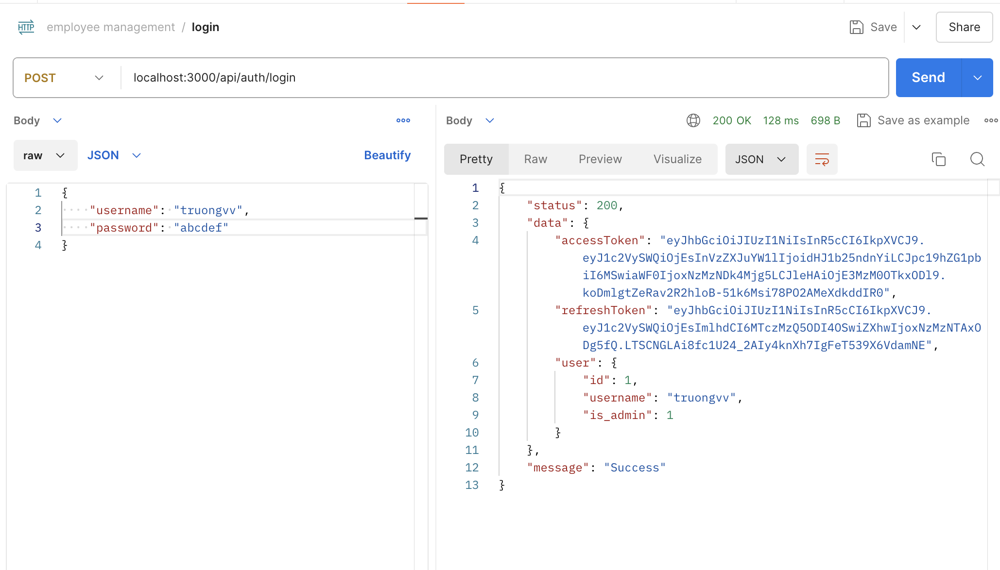 

- Login with invalid password: `api/auth/login` (POST)
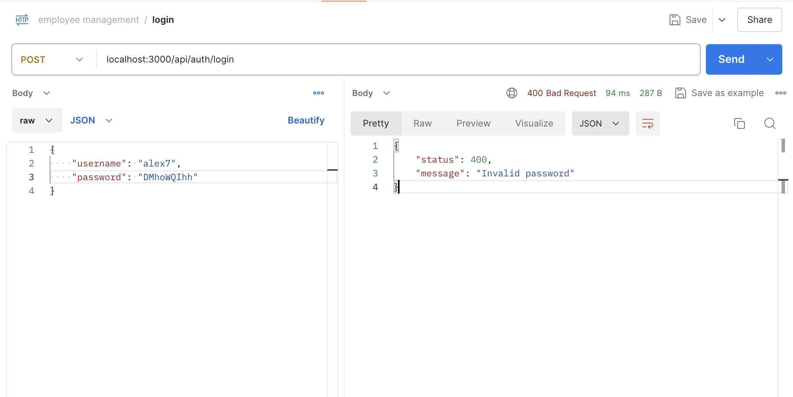 

- Refresh token: `api/auth/refresh-token` (POST)
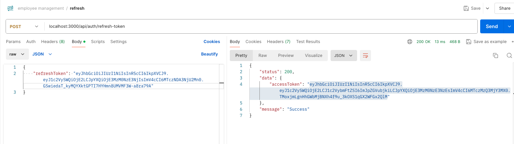

- No token (403)
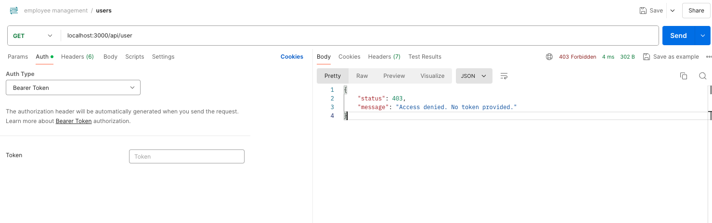

- Invalid token (401)
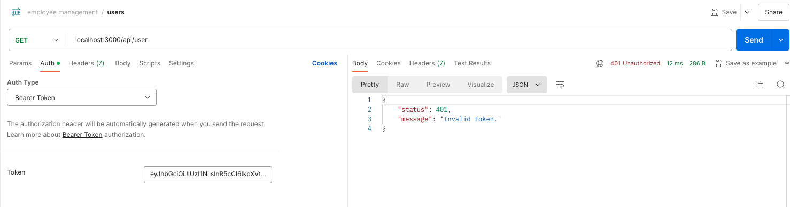

- Expired token (401)
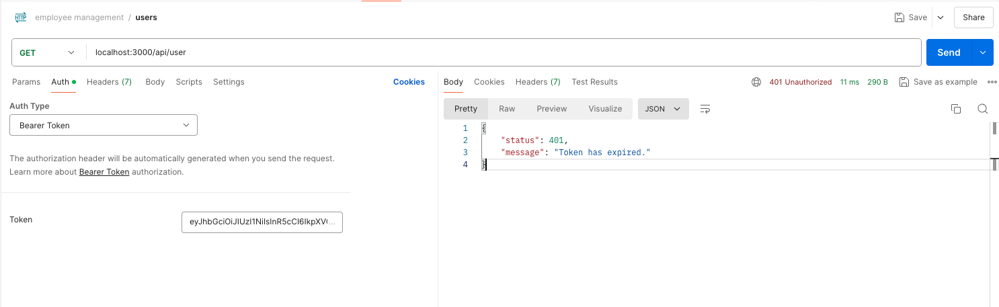

- Create new user: `api/user` (POST)
- Validated username already exits (400)
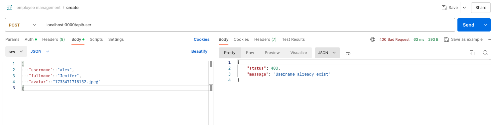
- When a new user is created by an admin, the admin will provide a random password string for the user's first login.
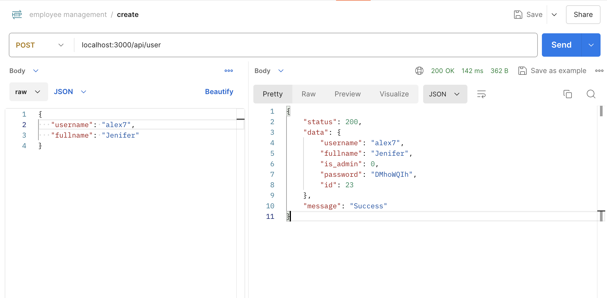

- Login first time: `api/auth/login` (POST)
- The status code 428 is returned with token anh remind user to change password.
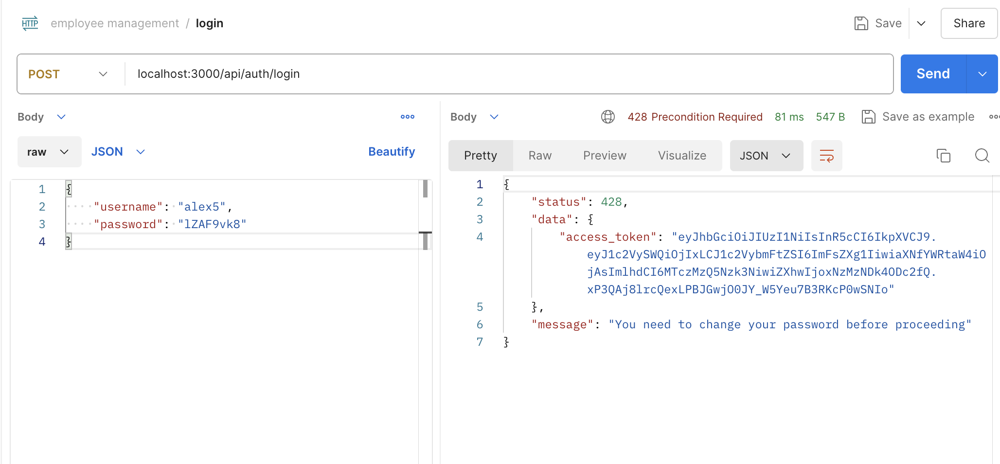

- Change password: `api/auth/change-password` (POST)
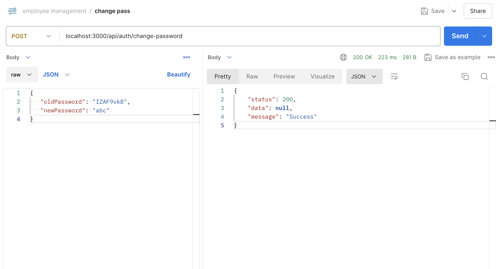

- Get all users: `api/user` (GET)
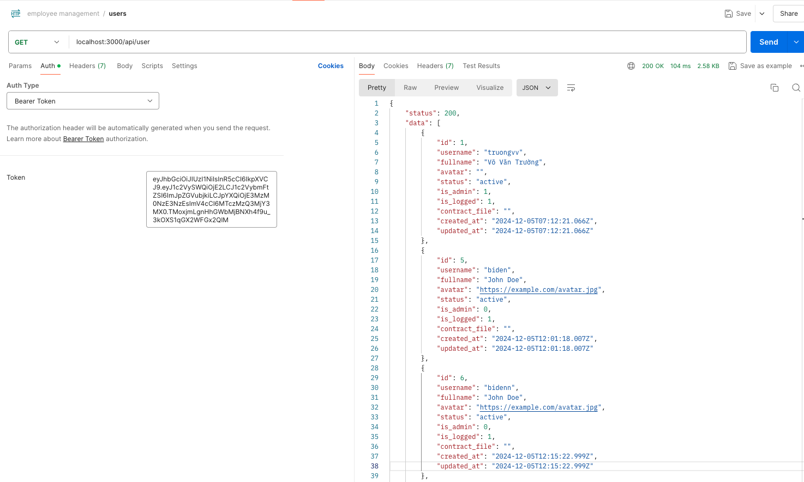 

- Get user by id: `api/user/{id}` (GET)
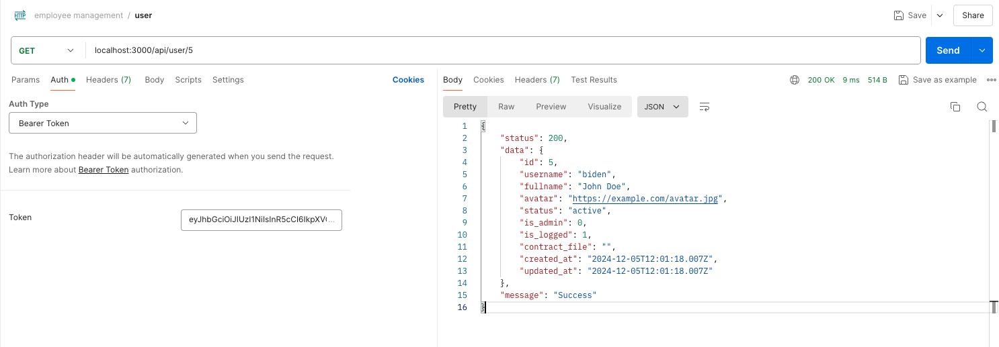 

- Update user: `api/user/{id}` (PUT)
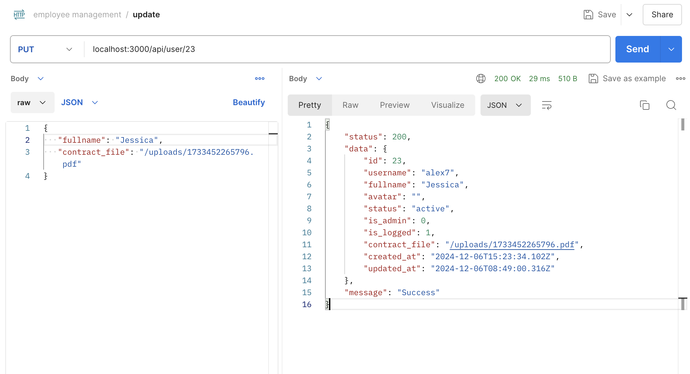

- Update profile: `api/auth/update-profile` (POST)
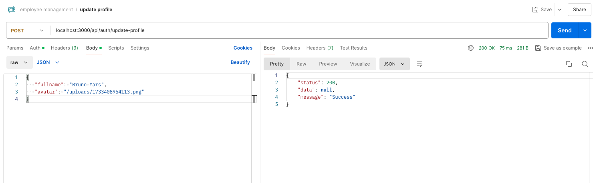

- Remove user: `api/user/{id}` (DELETE)
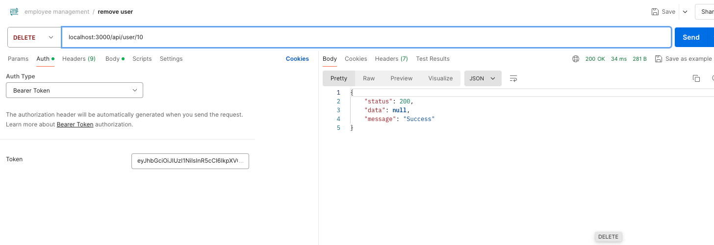

- Change status: `api/user/{id}/change-status` (POST)
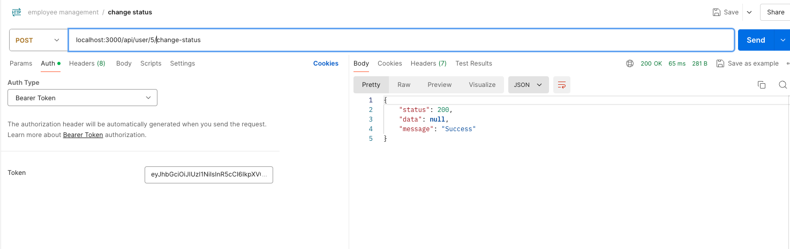

- Upload file: `api/upload` (POST)
- Loại file: image, video, pdf file,..
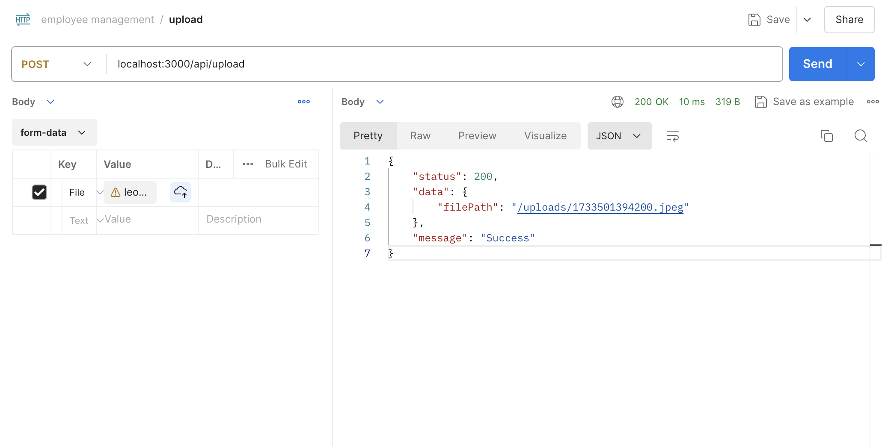
- View file: `http://localhost:3000/uploads/1733501394200.png.`

---

## License
By me, TruongIT2701
